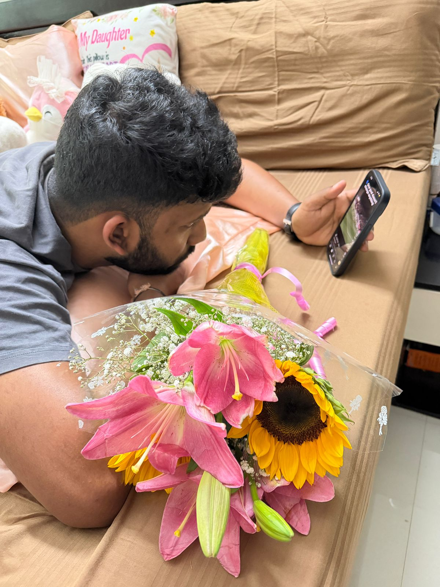
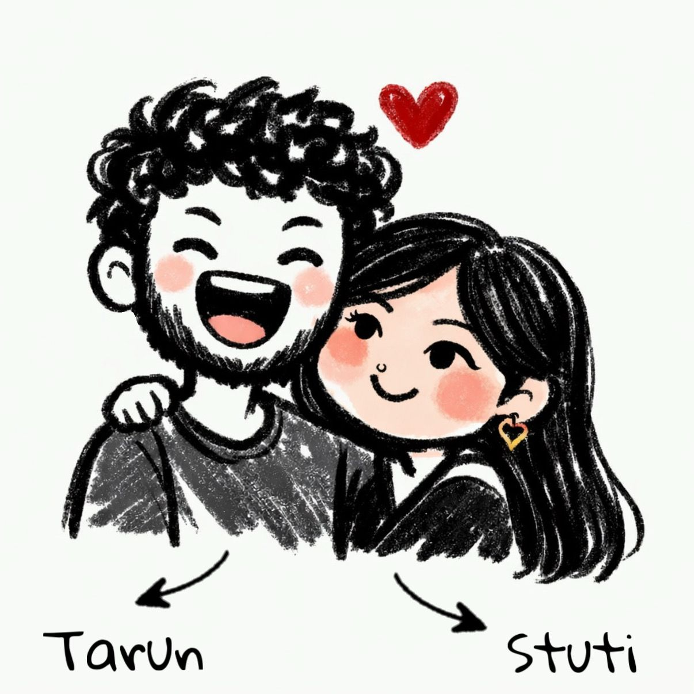

# valentines-website
<!DOCTYPE html>
<html lang="en">
<head>
  <meta charset="UTF-8">
  <title>Since you didn't have time to ask, i thought i'll do it. 
    Will you be my Valentine? 😏❤️</title>
  <meta name="viewport" content="width=device-width, initial-scale=1.0">

  
</head>

<body>

<canvas id="confetti"></canvas>

<!-- MUSIC -->
<audio id="loveSong">
  <source src="Espresso.mp3" type="audio/mpeg">
</audio>

  <h1>Since you didn't have time to ask, i thought i'll do it. Will you be my Valentine? 😏❤️</h1>
  
There is only one correct answer.

  

    <button id="yesBtn" onclick="yesClicked()">YES 💖</button>
    <button id="noBtn">NO 🙄</button>
  

  

    <h1>🎉 YAYYY 🎉</h1>
    

      Look at you making great life choices 😌  
      Music, confetti, memories…  
      this is your reward 💕
    

    

      
      
      
    

    

      You + Me = Valentine’s Day sorted ❤️😏
    

  

</body>
</html>
