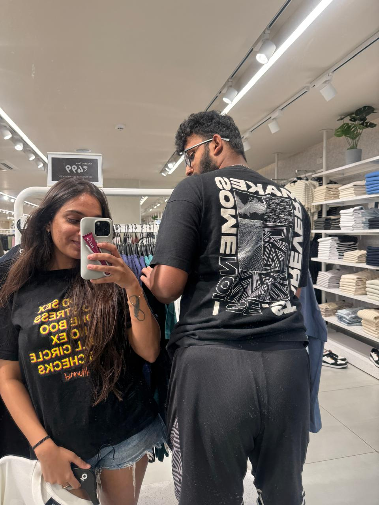
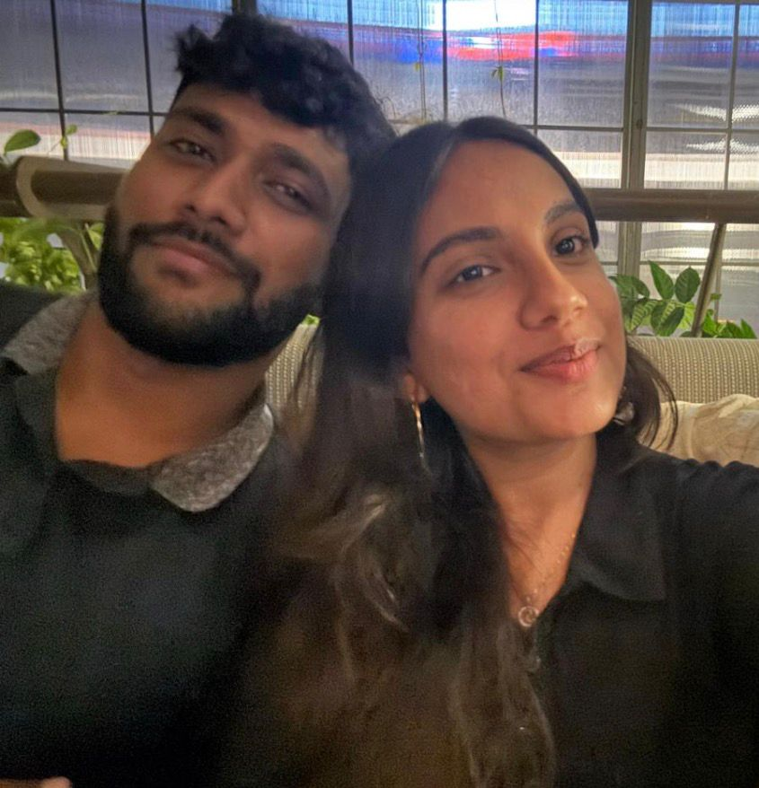
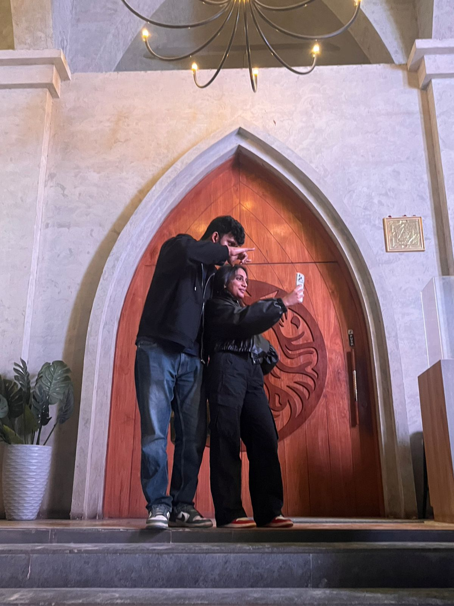

# valentines-website

<html lang="en">
<head>
  <meta charset="UTF-8">
  <title>Since you did NOT have time to ask, i thought i'll only do it. Will you be my V-A-L-E-N-T-I-N-E? 😏❤️ (huh) </title>
  <meta name="viewport" content="width=device-width, initial-scale=1.0">

  
</head>

<body>

<canvas id="confetti"></canvas>

<!-- MUSIC -->
<audio id="loveSong">
  <source src="Espresso.mp3" type="audio/mpeg">
</audio>

  
❤️

  <h1>Since you did NOT have time to ask, i thought i'll only do it. Will you be my V-A-L-E-N-T-I-N-E? 😏❤️ (huh) </h1>
  
There is only one correct answer.

  

    <button id="yesBtn" onclick="yesClicked()">YES 💖</button>
    <button id="noBtn">NO 🙄</button>
  

Wrong answers will be ignored 😌

  

    <h1>🎉 YAYYY 🎉</h1>
    

      Look at you making great life choices 😌  
      Now do not expect a gift because,
      I am your biggest gift 💕
    

    

      
      
      
      
      
      
    

    

      You better be happy because this took me 3 hours to build❤️😏
    

    <a href="letter.html" class="surprise-link">
  Click here for a surprise 💌
</a>
  

</body>
</html>
